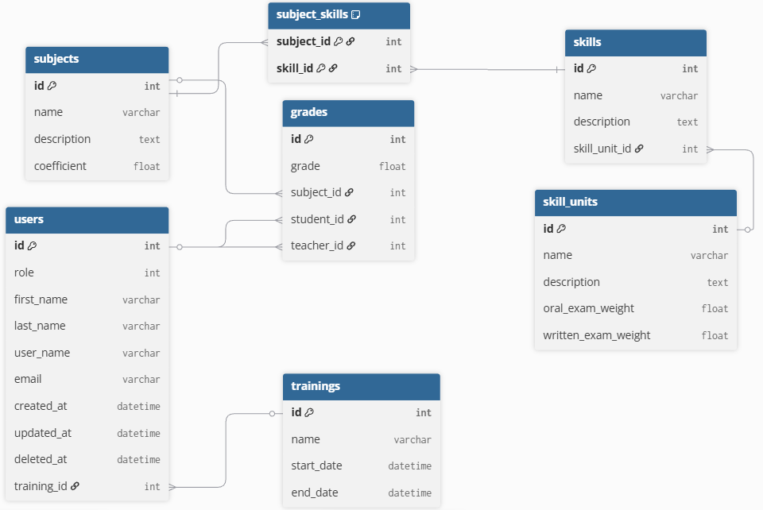

# Scorea 📝

Scorea est une application pour modéliser le règlement d'un diplôme.
Elle permet de créer des blocs de compétences et d'y définir les compétences associées,
afin de représenter formellement l'organisation des savoirs et les règles d'obtention du diplôme.

## Coding Style
Les conventions de code du projet sont décrites dans le fichier  
[CodingStyle.md](./docs/CodingStyle.md).

## Diagrammes

### Base de données

*Figure : Diagramme de la base de données (/docs/DatabaseDiagram.png)*

## Contributeurs

- [Clement BERNARD](https://github.com/clementBernard130)
- [Philippe OU](https://github.com/OuPhilippeCci)
- [Aymeric CLEMENT](https://github.com/aclement0)
- [Enzo SORIA BONET](https://github.com/esoriabonet)

projetFinCCI