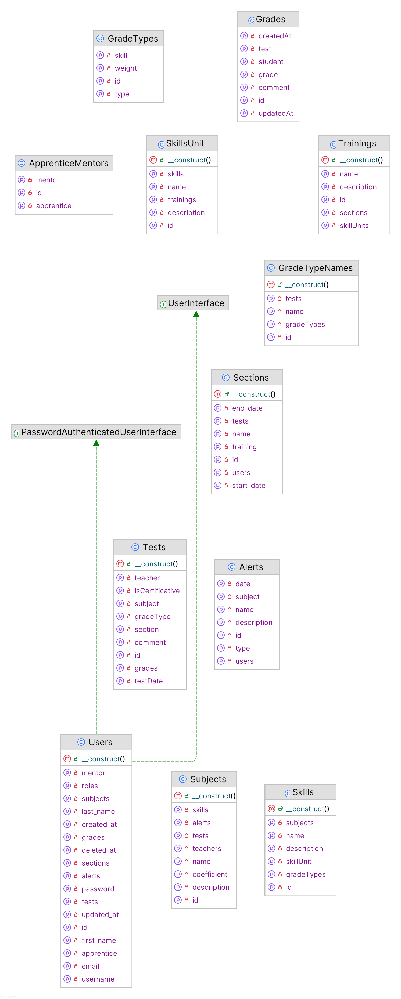
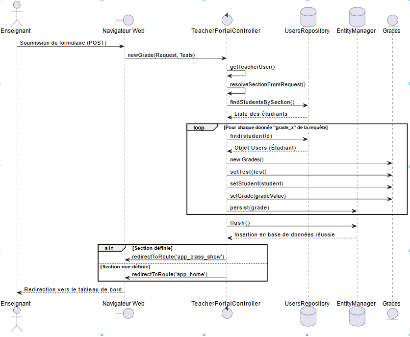
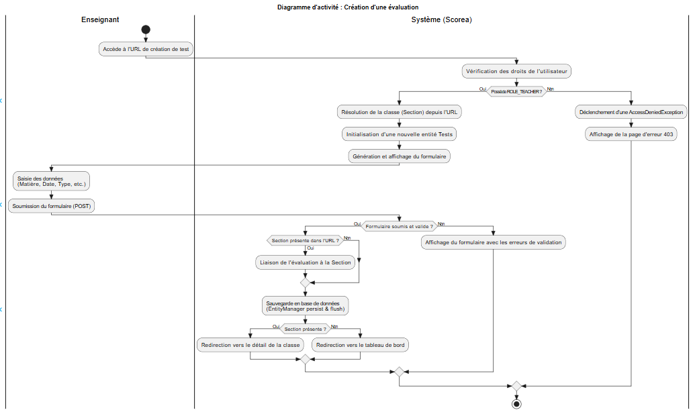
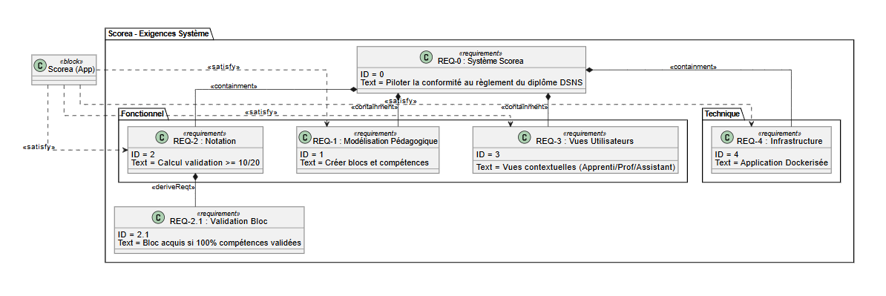

<!-- main -->
<p align="center"><a href="https://github.com/clementBernard130/Scorea"></a>&nbsp;&nbsp;<a href="https://symfony.com/"></a>&nbsp;&nbsp;<a href="https://www.php.net/"></a>&nbsp;&nbsp;<a href="https://github.com/clementBernard130/Scorea/projects"></a>&nbsp;&nbsp;<a href="https://github.com/clementBernard130/Scorea/blob/main/LICENSE"></a></p>
<!-- main -->
<p align="center"><a href="https://github.com/clementBernard130/Scorea/releases"></a>&nbsp;&nbsp;<a href="https://github.com/clementBernard130/Scorea"></a>&nbsp;&nbsp;<a href="https://github.com/clementBernard130/Scorea/graphs/contributors"></a></p>
<!-- ci -->
<p align="center"><a href="https://github.com/clementBernard130/Scorea/actions/workflows/tests.yml"></a></p>
<!-- divers -->
<p align="center"><a href="https://github.com/clementBernard130/Scorea/branches"></a>&nbsp;&nbsp;<a href="https://github.com/clementBernard130/Scorea/commits/"></a></p>
<!-- issues -->
<p align="center"><a href="https://github.com/clementBernard130/Scorea/issues"></a>&nbsp;&nbsp;<a href="https://github.com/clementBernard130/Scorea/issues?q=is%3Aissue%20state%3Aopen"></a>&nbsp;&nbsp;<a href="https://github.com/clementBernard130/Scorea/issues?q=is%3Aissue%20state%3Aclosed"></a></p>
<!-- labels issues -->
<p align="center"><a href="https://github.com/clementBernard130/Scorea/issues?q=is%3Aissue%20label%3Afeature"></a>&nbsp;&nbsp;<a href="https://github.com/clementBernard130/Scorea/issues?q=is%3Aissue%20label%3Abug"></a></p>
<!-- prs -->
<p align="center"><a href="https://github.com/clementBernard130/Scorea/pulls"></a>&nbsp;&nbsp;<a href="https://github.com/clementBernard130/Scorea/pulls?q=is%3Aopen+is%3Apr"></a>&nbsp;&nbsp;<a href="https://github.com/clementBernard130/Scorea/pulls?q=is%3Apr+is%3Aclosed"></a>&nbsp;&nbsp;<a href="https://github.com/clementBernard130/Scorea/pulls?q=is%3Apr+is%3Amerged"></a></p>

# Scorea

- [Scorea](#scorea)
  - [Présentation](#présentation)
  - [Stack technique](#stack-technique)
  - [Recette](#recette)
  - [Lancer le projet](#lancer-le-projet)
    - [Prérequis](#prérequis)
    - [Démarrage avec Docker Compose](#démarrage-avec-docker-compose)
  - [Utilisation](#utilisation)
    - [Portail enseignant](#portail-enseignant)
    - [Portail étudiant](#portail-étudiant)
    - [Interface d'administration](#interface-dadministration)
  - [Gestion de projet](#gestion-de-projet)
    - [Changelog : version 1.0](#changelog--version-10)
    - [TODO : version 1.1](#todo--version-11)
  - [Diagrammes](#diagrammes)
    - [Base de données](#base-de-données)
    - [Entités](#entités)
    - [Diagramme de séquence](#diagramme-de-séquence)
    - [Diagramme d'activité](#diagramme-dactivité)
    - [Diagramme d'exigences](#diagramme-dexigences)
  - [Coding Style](#coding-style)
  - [Équipe de développement](#équipe-de-développement)

---

## Présentation

**Scorea** est une application web permettant de modéliser le règlement d'un diplôme.

Elle offre aux enseignants la possibilité de :

- Définir des **formations** et leurs **sections** (promotions)
- Organiser les **unités de compétences** (blocs) et les **compétences** associées
- Créer des **évaluations** (tests) avec des types de notes et des pondérations
- Saisir et consulter les **notes** des étudiants
- Calculer automatiquement les **moyennes pondérées** selon les règles du diplôme

Les étudiants disposent d'un portail dédié pour consulter leurs résultats et leur progression.

## Stack technique

| Composant        | Technologie                       |
| ---------------- | --------------------------------- |
| Langage          | PHP 8.2+                          |
| Framework        | Symfony 7.3                       |
| ORM              | Doctrine ORM 3.5                  |
| Base de données  | PostgreSQL 16                     |
| Templates        | Twig 3                            |
| CSS              | Tailwind                          |
| Conteneurisation | Docker / Docker Compose           |
| CI               | GitHub Actions                    |

## Recette

| **Fonctionnalité**                                 | **À faire** | **En cours** | **Terminé** |
| -------------------------------------------------- | :---------: | :----------: | :---------: |
| Gestion des formations et sections                 |             |              |      ✅      |
| Gestion des unités de compétences et compétences   |             |              |      ✅      |
| Gestion des évaluations (tests & types de notes)  |             |              |      ✅      |
| Saisie des notes                                   |             |              |      ✅      |
| Calcul des moyennes pondérées                      |             |              |      ✅      |
| Gestion du poids des compétences                   |             |              |      ✅      |
| Portail étudiant (consultation des résultats)      |             |              |      ✅      |
| Authentification et gestion des rôles              |             |              |      ✅      |
| Interface d'administration (EasyAdmin)            |             |              |      ✅      |
| Pipeline CI (tests automatisés)                    |             |              |      ✅      |
| Gestion des maîtres d'apprentissage               |            |        ⌛      |             |
| Notifications et alertes                           |            |        ⌛      |             |

## Lancer le projet

### Prérequis

- [Docker](https://www.docker.com/) installé
- [Docker Compose](https://docs.docker.com/compose/) (inclus avec Docker Desktop)
- Cloner le dépôt :

```bash
git clone https://github.com/clementBernard130/Scorea.git
cd Scorea
```

### Démarrage avec Docker Compose

**1. Construire et démarrer les conteneurs :**

```bash
docker compose up --build
```

**2. Vérifier que les conteneurs sont actifs :**

```bash
docker compose ps
```

**3. Accéder à l'application :**

```
http://localhost
```

**4. Arrêter les conteneurs :**

```bash
docker compose down
```

## Utilisation

### Portail enseignant

1. **Connexion** — Accédez à l'application via un navigateur et connectez-vous avec un compte enseignant.
2. **Formations** — Créez ou sélectionnez une formation, puis gérez ses sections (promotions).
3. **Unités de compétences** — Définissez les blocs de compétences rattachés à la formation.
4. **Évaluations** — Créez des tests, associez-y des types de notes et configurez les pondérations.
5. **Saisie des notes** — Renseignez les notes des étudiants ; les moyennes sont calculées automatiquement.

### Portail étudiant

1. **Connexion** — Connectez-vous avec votre compte étudiant.
2. **Tableau de bord** — Consultez vos notes, moyennes et votre progression par unité de compétence.

### Interface d'administration

Accessible à `/admin` (compte administrateur requis), elle permet la gestion complète des utilisateurs, formations, sections et paramètres de l'application via **EasyAdmin**.

## Gestion de projet

### Changelog : version 1.0

- [X] Mise en place de l'infrastructure Docker (Symfony + PostgreSQL)
- [X] Modélisation des entités : formations, sections, unités de compétences, compétences, évaluations, notes
- [X] Authentification et gestion des rôles (étudiant, enseignant, administrateur)
- [X] Portail enseignant : gestion des formations, sections, évaluations et saisie des notes
- [X] Portail étudiant : consultation des résultats et de la progression
- [X] Calcul des moyennes pondérées par type de note et par compétence
- [X] Interface d'administration EasyAdmin
- [X] Pipeline CI avec GitHub Actions (tests PHPUnit sur PostgreSQL)

### TODO : version 1.1

- [ ] Gestion complète des maîtres d'apprentissage (`ApprenticeMentors`)
- [ ] Système de notifications et alertes pour les étudiants
- [ ] Export des résultats (PDF / CSV)
- [ ] Tableau de bord avec statistiques visuelles (graphiques de progression)
- [ ] Support de l'import en masse d'étudiants (CSV)

## Diagrammes

### Base de données


### Entités



### Diagramme de séquence



### Diagramme d'activité



### Diagramme d'exigences



## Coding Style

Les conventions de code du projet sont décrites dans [docs/CodingStyle.md](./docs/CodingStyle.md).

## Équipe de développement

- [BERNARD Clément](https://github.com/clementBernard130)
- [OU Philippe](https://github.com/OuPhilippeCci)
- [CLEMENT Aymeric](https://github.com/aclement0)
- [SORIA BONET Enzo](https://github.com/esoriabonet)

---

&copy; 2025-2026 DSNS DEV — CCI Avignon
